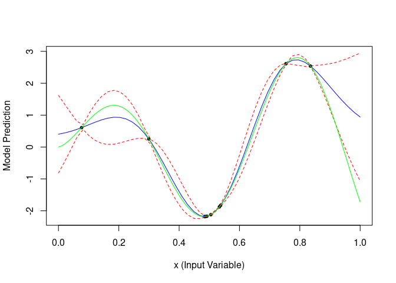

BayOptR
================
Jakob Richter

Kind of working skeletton\!


## SMBO

``` r
set.seed(1)
library(R6)
library(checkmate)
devtools::load_all()
```

    ## Loading BayOptR

    ## Loading required package: paradox

    ## Loading required package: data.table

``` r
fun = function(x) sqrt(x) * sin(x) # Alpine 02
search_space = ParamSet$new(params = list(ParamDbl$new("x", 0, 10)))
target_fun = TargetFun$new(fun, search_space)
design = generate_design_lhs(search_space, 5)
design = data.table(x = design$transpose())
design$y = target_fun$eval(design)

op = OptProblem$new(
  target_fun = target_fun,
  design = design,
  opt_iterator = OptIteratorBO$new(),
  opt_terminator = OptTerminatorSteps$new(5),
  surrogate_model = SurrogateModelGPfit$new(design = design),
  proposal_generator = ProposalGeneratorSingle$new(
    acq_optimizer = AcqOptimizerGenSA$new(control = list(maxit = 100)),
    acq_function = AcqFunctionCB$new(lambda = 2)
  )
)

res = bayopt(op)
res$surrogate_model$design
```

    ##          x          y
    ##     <list>      <num>
    ##  1: <list>  2.5375694
    ##  2: <list> -1.8290018
    ##  3: <list>  0.6090158
    ##  4: <list>  2.6113385
    ##  5: <list>  0.2521211
    ##  6: <list> -1.8758919
    ##  7: <list> -2.1207274
    ##  8: <list> -2.1706081
    ##  9: <list> -2.1798934
    ## 10: <list> -2.1818586

``` r
res$surrogate_model$predict(res$surrogate_model$design)
```

    ##           mean           se
    ##          <num>        <num>
    ##  1:  2.5375694 3.626292e-14
    ##  2: -1.8290018 2.016334e-11
    ##  3:  0.6090158 0.000000e+00
    ##  4:  2.6113385 1.300064e-13
    ##  5:  0.2521211 2.456620e-12
    ##  6: -1.8758919 0.000000e+00
    ##  7: -2.1207274 5.197942e-12
    ##  8: -2.1706081 0.000000e+00
    ##  9: -2.1798934 7.322023e-12
    ## 10: -2.1818586 6.923903e-12

``` r
plot(res$surrogate_model$storage$model)
curve(fun(x*10), add = TRUE, col = "green") # GP_fit does some scaling
```

<!-- -->

## Multipoint MBO

``` r
devtools::load_all()
```

    ## Loading BayOptR

``` r
op = OptProblem$new(
  target_fun = target_fun,
  design = design,
  opt_iterator = OptIteratorBO$new(),
  opt_terminator = OptTerminatorSteps$new(5),
  surrogate_model = SurrogateModelGPfit$new(design = design),
  proposal_generator = ProposalGeneratorMultiCL$new(
    acq_optimizer = AcqOptimizerGenSA$new(control = list(maxit = 100)),
    acq_function = AcqFunctionCB$new(lambda = 2),
    n = 2,
    lie = "min"
  )
)

res = bayopt(op)
```
